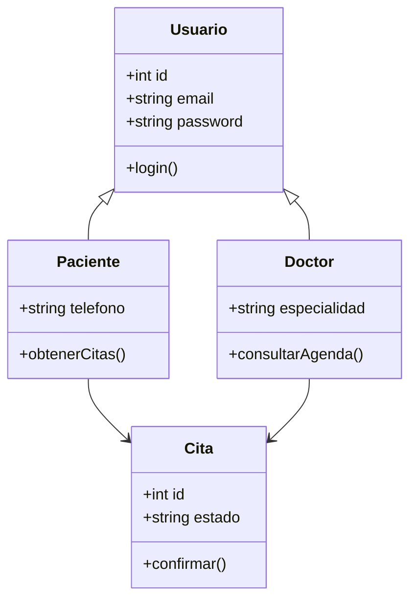

# Diagramas de CitasApp

```mermaid
classDiagram
    class Usuario {
        +int id
        +string email
        +string password
        +login()
    }
    class Paciente {
        +string telefono
        +obtenerCitas()
    }
    class Doctor {
        +string especialidad
        +consultarAgenda()
    }
    class Cita {
        +int id
        +string estado
        +confirmar()
    }

    Usuario <|-- Paciente
    Usuario <|-- Doctor
    Paciente --> Cita
    Doctor --> Cita
```

    
    
