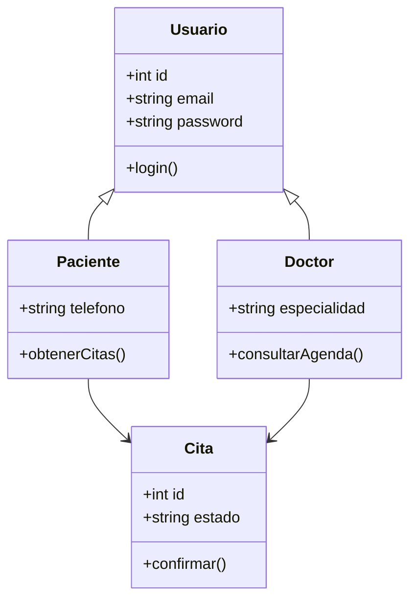

# Diagramas de CitasApp

Este diagrama Representa las entidades principales que gestionan las citas y sus relaciones.

## Cláusula de IA

Este proyecto fue desarrollado con apoyo de herramientas de inteligencia artificial para la generación de ideas, mejora de documentación y asistencia durante el proceso de desarrollo. 
    
    
